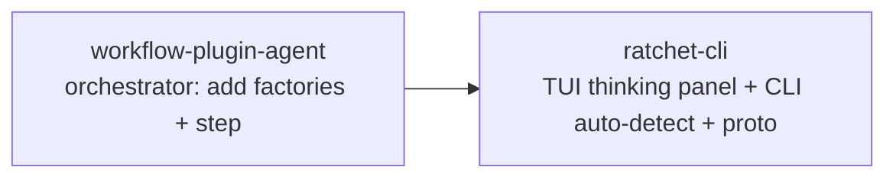

# Local Inference Integration: Ratchet-CLI

**Date:** 2026-03-28
**Status:** Approved (updated for orchestrator consolidation)
**Depends on:** workflow-plugin-agent v0.5.3+ (PR #2 merged, local inference providers)

## Goal

Enable ratchet users to run local AI models (via Ollama or llama.cpp) with thinking trace visibility in the TUI — zero API keys, full privacy.

## Context: Orchestrator Consolidation

The `ratchet/ratchetplugin` package was merged into `workflow-plugin-agent/orchestrator`. This means:
- **ratchet repo is no longer in the chain** — provider factories live in `workflow-plugin-agent/orchestrator/provider_registry.go`
- **ratchet-cli imports directly** from `workflow-plugin-agent/orchestrator` via local replace directive
- All changes are in **two repos**: workflow-plugin-agent (orchestrator wiring) and ratchet-cli (TUI + CLI + proto)

## Release Chain



No intermediate ratchet repo release needed.

## 1. Orchestrator Provider Factories (`workflow-plugin-agent` repo)

The root-level `provider_registry.go` already has ollama/llama_cpp factories, but the **orchestrator's** `provider_registry.go` does not. The orchestrator is what ratchet-cli uses.

### Provider Factory Registration

**File:** `orchestrator/provider_registry.go`

Add `"ollama"` and `"llama_cpp"` factories to `NewProviderRegistry()` (after line 70):

```go
r.factories["ollama"] = ollamaProviderFactory
r.factories["llama_cpp"] = llamaCppProviderFactory
```

Add factory functions:

```go
func ollamaProviderFactory(_ string, cfg LLMProviderConfig) (provider.Provider, error) {
    return provider.NewOllamaProvider(provider.OllamaConfig{
        Model: cfg.Model, BaseURL: cfg.BaseURL, MaxTokens: cfg.MaxTokens,
    }), nil
}

func llamaCppProviderFactory(_ string, cfg LLMProviderConfig) (provider.Provider, error) {
    return provider.NewLlamaCppProvider(provider.LlamaCppConfig{
        BaseURL: cfg.BaseURL, ModelPath: cfg.Model, ModelName: cfg.Model, MaxTokens: cfg.MaxTokens,
    }), nil
}
```

### Step Factory Registration

**File:** `orchestrator/plugin.go`

Add `"step.model_pull"` to `Manifest.StepTypes` and to `StepFactories()`:
```go
"step.model_pull": agentplugin.NewModelPullStepFactory(),
```

**Total: 2 files changed in workflow-plugin-agent/orchestrator.**

## 2. Ratchet-CLI Proto Changes

### New Thinking Event

**File:** `internal/proto/ratchet.proto`

```protobuf
message ChatEvent {
  oneof event {
    // ... existing ...
    ThinkingBlock thinking = 15;
  }
}

message ThinkingBlock {
  string content = 1;
}
```

Regenerate proto with `protoc`.

### Daemon Streaming

**File:** `internal/daemon/chat.go`

Add case in the event routing switch:
```go
case "thinking":
    stream.Send(&pb.ChatEvent{Event: &pb.ChatEvent_Thinking{
        Thinking: &pb.ThinkingBlock{Content: evt.Thinking},
    }})
```

## 3. TUI Collapsible Thinking Panel

### Component

**File:** `internal/tui/components/thinking.go`

```go
type ThinkingPanel struct {
    content   string
    collapsed bool
}
```

- Styled box with "Thinking..." header
- Toggle with `Ctrl+H` keybinding (Ctrl+T is taken by team view)
- Collapsed: "Thinking (N lines) ▶"
- Expanded: full text in dimmed/italic style
- Auto-starts expanded, auto-collapses when first text token arrives

### Chat Page Integration

**File:** `internal/tui/pages/chat.go`

- `ChatEvent_Thinking` → feed content to ThinkingPanel
- Panel renders above the streaming response
- Auto-collapse on first `ChatEvent_Token`

## 4. CLI Provider Auto-Detect

**File:** `cmd/ratchet/cmd_provider.go`

When provider type is `"ollama"` or `"llama_cpp"`, skip API key prompt and offer base URL with sensible default:

```
$ ratchet provider add ollama
Alias [ollama]: my-local
Model [llama3]: qwen3.5:27b-q4_K_M
Base URL [http://localhost:11434]:
✓ Provider "my-local" added (ollama)
```

For `llama_cpp`, default base URL: `http://localhost:8081/v1`.

## 5. Testing

- **workflow-plugin-agent**: Unit test for ollama + llama_cpp factory creation in orchestrator/provider_registry_test.go
- **ratchet-cli**: Bubbletea test for ThinkingPanel component, test provider add with local types (no API key prompt)
- All tests use mocks — no live models

## 6. File Summary

### workflow-plugin-agent repo
```
orchestrator/provider_registry.go   MODIFY  add ollama + llama_cpp factories
orchestrator/plugin.go              MODIFY  register step.model_pull in manifest + factories
```

### ratchet-cli repo
```
internal/proto/ratchet.proto         MODIFY  add ThinkingBlock event
internal/proto/*.pb.go               REGEN   protoc output
internal/daemon/chat.go              MODIFY  route thinking events
internal/tui/components/thinking.go  NEW     collapsible thinking panel
internal/tui/pages/chat.go           MODIFY  integrate thinking panel
cmd/ratchet/cmd_provider.go          MODIFY  auto-detect local providers
go.mod                               MODIFY  (replace directive already points at local)
```

## 7. Dependencies

No new dependencies. ratchet-cli already has a local replace directive to workflow-plugin-agent. The ollama/ollama/api dependency is already in workflow-plugin-agent's go.mod.
