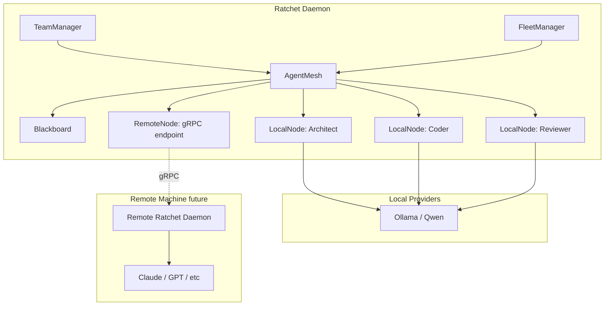
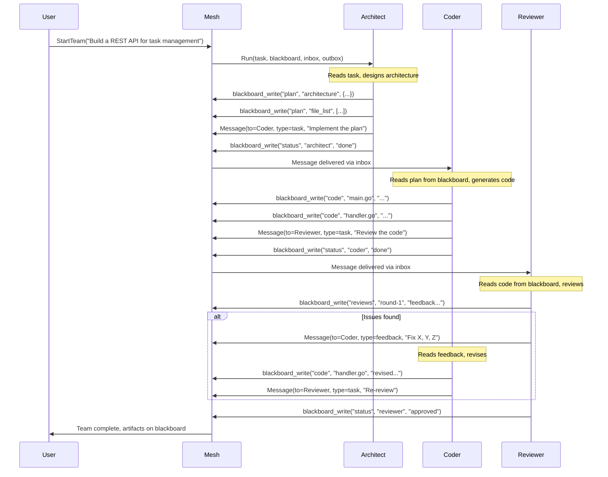

# Agent Mesh Design

**Date:** 2026-04-04
**Status:** Proposed
**Repo:** ratchet-cli

## Goal

Build a multi-agent orchestration mesh into ratchet-cli that supports local (goroutine) and remote (gRPC) agent nodes from day one. Agents collaborate via a shared blackboard and direct messaging, powered by local LLMs (Ollama/Qwen) with future support for remote providers (Claude, GPT, Gemini).

The demo deliverable: a 3-agent code-generation team (Architect + Coder + Reviewer) running on local Qwen models via Ollama.

## Architecture



### Key Components

**`internal/mesh` package** — the core abstraction layer.

| Type | Responsibility |
|------|---------------|
| `AgentMesh` | Registry of nodes, blackboard owner, message router, lifecycle manager |
| `Node` | Interface for any agent execution unit (local or remote) |
| `LocalNode` | Goroutine-based node wrapping a provider chat loop |
| `RemoteNode` | gRPC client stub proxying to a remote daemon |
| `Blackboard` | Shared key-value store with sections, revisions, watchers |
| `Message` | Envelope for agent-to-agent communication |

## Node Interface

```go
// Node is a single agent execution unit — local or remote.
type Node interface {
    ID() string
    Run(ctx context.Context, task string, bb *Blackboard, inbox <-chan Message, outbox chan<- Message) error
    Info() NodeInfo
}

type NodeInfo struct {
    Name     string
    Role     string
    Model    string
    Provider string
    Location string // "local" or "grpc://host:port"
}
```

The `Run` signature gives each node: a task description, the shared blackboard, and bidirectional message channels. The mesh routes messages between nodes based on the `To` field.

**LocalNode** wraps `workflow-plugin-agent`'s provider interface:
- Creates a chat loop with system prompt + tools
- Injects blackboard tools (read/write/list) and messaging tools (send_message)
- Calls `provider.Chat()` or `provider.Stream()` in a loop until the agent signals completion
- Writes final status to blackboard `status` section

**RemoteNode** proxies over gRPC:
- Connects to a remote ratchet daemon at `grpc://host:port`
- Forwards `Run()` as a streaming RPC
- Syncs blackboard entries bidirectionally
- Message channels map to gRPC streaming events

## Blackboard

```go
type Blackboard struct {
    mu       sync.RWMutex
    sections map[string]*Section
    watchers []func(key string, val Entry)
}

type Section struct {
    Entries map[string]Entry
}

type Entry struct {
    Key       string
    Value     any
    Author    string     // node ID that wrote it
    Revision  int64      // monotonic, for conflict detection
    Timestamp time.Time
}
```

### Predefined Sections

| Section | Purpose | Example keys |
|---------|---------|-------------|
| `plan` | Architect's design decisions | `architecture`, `file_list`, `interfaces` |
| `code` | Generated source files | `main.go`, `handler.go` |
| `reviews` | Reviewer feedback | `review-round-1`, `review-round-2` |
| `status` | Agent status/progress | `architect:done`, `coder:working` |
| `artifacts` | Final outputs | `summary`, `diff` |

Sections are not hard-coded — agents can create arbitrary sections. The predefined ones are conventions established by system prompts.

### Blackboard as Agent Tools

Each node's chat loop includes these tools so the LLM interacts with shared state naturally:

- **`blackboard_read`** `{section, key}` — read a single entry or list all keys in a section
- **`blackboard_write`** `{section, key, value}` — write/overwrite an entry (auto-stamps author + revision)
- **`blackboard_list`** `{section?}` — list all sections, or all keys in a section
- **`send_message`** `{to, type, content}` — send a message to another agent by name (or `*` for broadcast)

## Message Protocol

```go
type Message struct {
    ID        string
    From      string              // node ID
    To        string              // node ID, or "*" for broadcast
    Type      string              // "task", "result", "feedback", "request"
    Content   string
    Metadata  map[string]string
    Timestamp time.Time
}
```

The mesh routes messages: unicast delivers to the target node's inbox channel, broadcast delivers to all nodes except sender.

## Orchestration Flow



### Agent Lifecycle

1. `Mesh.SpawnTeam(task, []NodeConfig)` creates nodes, initializes blackboard, starts each node's `Run` goroutine
2. Each node runs an autonomous chat loop: system prompt + tools (blackboard + messaging) + provider
3. Nodes signal completion by writing to `status` section
4. Mesh watches `status` — when all nodes report done (or timeout), team is complete
5. Mesh collects artifacts from blackboard, returns to caller

No separate orchestrator node is required. The Architect naturally orchestrates by writing the plan and messaging the Coder. Any agent can message any other agent.

## Team Configuration

Teams are defined declaratively in YAML:

```yaml
# .ratchet/teams/code-gen.yaml
name: code-gen
agents:
  - name: architect
    role: architect
    provider: local-qwen
    model: qwen3:14b
    max_iterations: 20
    system_prompt: |
      You are a software architect. Given a task, design the architecture:
      file structure, interfaces, data flow. Write your design to the
      blackboard "plan" section, then message the coder to begin implementation.
    tools: [blackboard_read, blackboard_write, blackboard_list, send_message]

  - name: coder
    role: coder
    provider: local-qwen
    model: qwen3:8b
    max_iterations: 40
    system_prompt: |
      You are a senior developer. Read the architecture plan from the
      blackboard, implement each file, write code to the "code" section.
      When done, message the reviewer for review.
    tools: [blackboard_read, blackboard_write, blackboard_list, send_message]

  - name: reviewer
    role: reviewer
    provider: local-qwen
    model: qwen3:8b
    max_iterations: 20
    system_prompt: |
      You are a code reviewer. Read code from the blackboard "code" section,
      review for correctness, style, and edge cases. Write feedback to
      "reviews" section. If issues found, message the coder with feedback.
      If approved, write "approved" to status.
    tools: [blackboard_read, blackboard_write, blackboard_list, send_message]

timeout: 10m
max_review_rounds: 3
```

## Provider Setup

### Seamless Ollama Install

`ratchet provider setup ollama` performs:

1. Check if `ollama` binary exists at standard paths or user-specified `--path`
2. If missing, install via Homebrew (macOS) or direct download (Linux)
3. Start Ollama server if not running
4. Pull specified model (default: `qwen3:8b`)
5. Register as a ratchet provider

### Pre-installed / Remote Ollama

```sh
ratchet provider add my-ollama --type ollama --model qwen3:8b --base-url http://192.168.1.50:11434
```

### Provider-per-Agent

Each agent in a team can use a different provider/model. The team YAML `provider` field references a registered provider alias. This enables mixing local and remote models in the same team.

## gRPC Extensions

New proto messages and RPCs for remote mesh support:

```protobuf
// Agent mesh node registration
message RegisterNodeReq {
    string name = 1;
    string role = 2;
    string model = 3;
    string provider = 4;
    repeated string tools = 5;
}

message RegisterNodeResp {
    string node_id = 1;
}

// Blackboard sync between mesh peers
message BlackboardSync {
    string section = 1;
    string key = 2;
    bytes value = 3;
    string author = 4;
    int64 revision = 5;
}

// Extend RatchetDaemon service:
// rpc RegisterMeshNode(RegisterNodeReq) returns (RegisterNodeResp);
// rpc MeshStream(stream MeshEvent) returns (stream MeshEvent);
```

`MeshStream` is a bidirectional streaming RPC that carries blackboard syncs and routed messages between daemons. This is scaffolded but not fully implemented in the initial delivery — the interface is in place so remote nodes can be wired later.

## Scope Boundaries

**In scope (this delivery):**
- `internal/mesh` package (Node, AgentMesh, Blackboard, Message, LocalNode)
- RemoteNode struct with gRPC stub (compiles, connects, but execution deferred)
- Blackboard tools for agent chat loops
- Wire TeamManager to use mesh instead of stubs
- Team YAML configuration loading
- `ratchet provider setup ollama` command
- 3-agent code-gen demo with Qwen
- Proto extensions for mesh (messages defined, RPCs scaffolded)

**Out of scope (future):**
- Full RemoteNode execution (blackboard sync, message relay over gRPC)
- Cross-machine mesh discovery
- Persistent blackboard (currently in-memory only)
- Agent memory across team runs
- Web UI for team visualization
