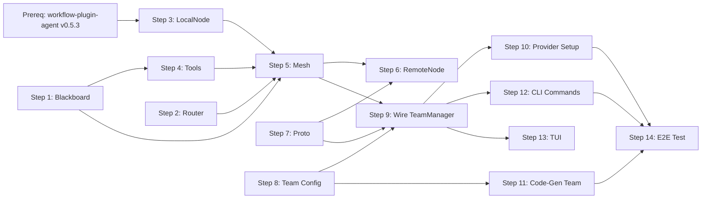

# Agent Mesh Implementation Plan

**Date:** 2026-04-04
**Design:** [2026-04-04-agent-mesh-design.md](2026-04-04-agent-mesh-design.md)
**Repo:** ratchet-cli

## Prerequisites

**workflow-plugin-agent executor mesh support** must be implemented and released first.

See: `workflow-plugin-agent/docs/plans/2026-04-04-executor-mesh-support-plan.md`

That plan adds three features to `executor.Config`:
- `Inbox <-chan provider.Message` — message injection between loop iterations
- `OnEvent func(Event)` — real-time event streaming (tool calls, thinking, text)
- `ShouldStop func() (reason string)` — custom termination (e.g. blackboard status check)

Once released (target: `v0.5.3`), update `go.mod` to reference the new tag before starting Step 3 below.

## Steps

### Step 1: Blackboard

Create `internal/mesh/blackboard.go`.

- `Blackboard` struct with `sync.RWMutex`, sections map, watcher slice
- `Section` and `Entry` types
- Methods: `Read(section, key)`, `Write(section, key, value, author)`, `List(section)`, `ListSections()`, `Watch(fn)`
- Monotonic revision counter per entry
- Thread-safe for concurrent agent access

**Tests:** `blackboard_test.go` — concurrent read/write, watcher notifications, revision ordering.

**Files:** `internal/mesh/blackboard.go`, `internal/mesh/blackboard_test.go`

---

### Step 2: Message Router

Create `internal/mesh/message.go` and `internal/mesh/router.go`.

- `Message` struct (ID, From, To, Type, Content, Metadata, Timestamp)
- `Router` manages per-node inbox channels
- `Router.Register(nodeID)` returns inbox `<-chan Message`
- `Router.Send(msg)` delivers to target inbox (unicast) or all inboxes (broadcast when `To == "*"`)
- `Router.Unregister(nodeID)` cleans up

**Tests:** `router_test.go` — unicast delivery, broadcast, unregistered target returns error.

**Files:** `internal/mesh/message.go`, `internal/mesh/router.go`, `internal/mesh/router_test.go`

---

### Step 3: Node Interface and LocalNode

**Requires:** workflow-plugin-agent `v0.5.3`+ with executor mesh support.

Create `internal/mesh/node.go` and `internal/mesh/local_node.go`.

- `Node` interface: `ID()`, `Run(ctx, task, bb, inbox, outbox)`, `Info()`
- `NodeInfo` struct (Name, Role, Model, Provider, Location)
- `NodeConfig` struct for constructing nodes from team YAML
- `LocalNode` implementation:
  - Holds a `provider.Provider` reference (from workflow-plugin-agent)
  - `Run()` delegates to `executor.Execute()` with:
    - `cfg.Inbox` wired to the mesh's message-to-provider adapter (converts mesh `Message` to `provider.Message`)
    - `cfg.OnEvent` wired to forward executor events to the mesh's TeamEvent stream
    - `cfg.ShouldStop` checks `blackboard["status"][nodeID]` for "done" or "approved"
  - Registers blackboard + messaging tools into a `tools.Registry` passed to the executor
  - Loop terminates via ShouldStop, max iterations, or context cancellation

**Tests:** `local_node_test.go` — run with a scripted provider, verify blackboard writes, message sends, and ShouldStop termination.

**Files:** `internal/mesh/node.go`, `internal/mesh/local_node.go`, `internal/mesh/local_node_test.go`

---

### Step 4: Blackboard and Messaging Agent Tools

Create `internal/mesh/tools.go`.

- `BlackboardReadTool` — implements `tools.Tool` interface, reads from blackboard
- `BlackboardWriteTool` — writes to blackboard, stamps author from node context
- `BlackboardListTool` — lists sections or keys within a section
- `SendMessageTool` — sends a `Message` via the node's outbox channel
- Each tool returns a `provider.ToolDef` for the provider's tool list and has an `Execute(ctx, args)` method

**Tests:** `tools_test.go` — each tool with mock blackboard/outbox.

**Files:** `internal/mesh/tools.go`, `internal/mesh/tools_test.go`

---

### Step 5: AgentMesh Orchestrator

Create `internal/mesh/mesh.go`.

- `AgentMesh` struct: holds `Blackboard`, `Router`, node registry, team config
- `SpawnTeam(ctx, task, configs []NodeConfig) (TeamHandle, error)`:
  1. Initialize blackboard with empty predefined sections
  2. Create nodes from configs (LocalNode or RemoteNode based on `Location`)
  3. Register each node with router
  4. Wire each node's outbox to the router (goroutine: read outbox, call `router.Send()`)
  5. Wire router inbox to each LocalNode's `executor.Config.Inbox` (adapter: mesh Message → provider.Message)
  6. Forward each node's `executor.Event` via `cfg.OnEvent` to the TeamHandle's event channel
  7. Start each node's `Run()` in a goroutine
  8. Start a watcher goroutine monitoring `status` section for all-done
  9. Return `TeamHandle` with team ID, event channel, cancel func
- `TeamHandle` struct: `ID string`, `Done <-chan TeamResult`, `Events <-chan mesh.Event`, `Cancel func()`
- `TeamResult` struct: `Status string`, `Artifacts map[string]Entry`, `Errors []error`

**Tests:** `mesh_test.go` — spawn team with scripted providers, verify full flow (architect writes plan, coder writes code, reviewer approves).

**Files:** `internal/mesh/mesh.go`, `internal/mesh/mesh_test.go`

---

### Step 6: RemoteNode Stub

Create `internal/mesh/remote_node.go`.

- `RemoteNode` struct with gRPC `ClientConn` and target address
- Implements `Node` interface
- `Run()` connects to remote daemon, sends task + streams events (returns `ErrNotImplemented` for now with a log message)
- `Info()` returns `Location: "grpc://host:port"`

**No tests** — this is a stub that compiles and satisfies the interface. Real implementation is future work.

**Files:** `internal/mesh/remote_node.go`

---

### Step 7: Proto Extensions

Update `internal/proto/ratchet.proto`.

- Add `RegisterNodeReq`, `RegisterNodeResp` messages
- Add `BlackboardSync` message
- Add `MeshEvent` message (oneof: blackboard_sync, agent_message, node_registered)
- Add `RegisterMeshNode` and `MeshStream` RPCs to `RatchetDaemon` service (scaffolded, handler returns Unimplemented)
- Regenerate `ratchet.pb.go` and `ratchet_grpc.pb.go`

**Files:** `internal/proto/ratchet.proto`, `internal/proto/ratchet.pb.go`, `internal/proto/ratchet_grpc.pb.go`

---

### Step 8: Team YAML Configuration

Create `internal/mesh/config.go`.

- `TeamConfig` struct matching the YAML schema from design doc
- `LoadTeamConfig(path string) (*TeamConfig, error)` — reads and validates a team YAML file
- `LoadTeamConfigs(dir string) ([]TeamConfig, error)` — discovers team YAMLs from `.ratchet/teams/` and `~/.ratchet/teams/`
- Validation: all agents must have a name, provider must be registered, tools must be from known set

**Tests:** `config_test.go` — parse valid YAML, reject invalid configs.

**Files:** `internal/mesh/config.go`, `internal/mesh/config_test.go`

---

### Step 9: Wire TeamManager to Mesh

Modify `internal/daemon/teams.go`.

- `TeamManager` gets an `*mesh.AgentMesh` field
- `StartTeam()` now calls `mesh.SpawnTeam()` instead of the stub goroutine
- Map `TeamHandle.Events` to `pb.TeamEvent` stream events (AgentSpawned, AgentMessage, TokenDelta, Complete)
- Map executor `Event` types to proto: `EventToolCallStart` → `ToolCallStart`, `EventText` → `TokenDelta`, etc.
- `GetTeamStatus()` queries mesh for live node statuses
- Preserve backward compatibility with existing gRPC contract

**Tests:** Update `teams_test.go` and `integration_team_test.go`.

**Files:** `internal/daemon/teams.go`, `internal/daemon/teams_test.go`, `internal/daemon/integration_team_test.go`

---

### Step 10: Provider Setup Command

Create/extend `cmd/ratchet/cmd_provider.go`.

- `ratchet provider setup ollama` subcommand:
  1. Check for `ollama` binary (standard paths + `--path` flag)
  2. If missing: `brew install ollama` on macOS, direct download on Linux
  3. Start `ollama serve` if not already running (check port 11434)
  4. Pull model: `ollama pull <model>` (default `qwen3:8b`, override with `--model`)
  5. Register provider: write to ratchet config
- `ratchet provider add` already exists — ensure `--base-url` works for remote Ollama instances
- `ratchet provider setup` prints status at each step with clear success/failure messages

**Tests:** Unit test the detection and config-writing logic (mock the binary/brew calls).

**Files:** `cmd/ratchet/cmd_provider.go`

---

### Step 11: Built-in Code-Gen Team Definition

Create `internal/mesh/teams/code-gen.yaml` as an embedded default.

- Architect agent: `qwen3:14b` (or fallback to `qwen3:8b`), planning system prompt, 20 max iterations
- Coder agent: `qwen3:8b`, implementation system prompt, 40 max iterations
- Reviewer agent: `qwen3:8b`, review system prompt, 20 max iterations
- Timeout: 10 minutes
- Max review rounds: 3
- Embed via `//go:embed` so it ships with the binary

**Files:** `internal/mesh/teams/code-gen.yaml`, embed directive in `internal/mesh/config.go`

---

### Step 12: `ratchet team` CLI Commands

Extend `cmd/ratchet/cmd_team.go`.

- `ratchet team start <name|yaml-path> --task "description"` — starts a team from a named config or YAML path
- `ratchet team status <team-id>` — shows live agent statuses, blackboard summary
- `ratchet team list` — lists active and recent teams
- `ratchet team logs <team-id>` — streams team events (agent messages, tool calls, blackboard writes)
- Wire to existing gRPC `StartTeam`/`GetTeamStatus` RPCs

**Files:** `cmd/ratchet/cmd_team.go`

---

### Step 13: TUI Team View Integration

Update `internal/tui/pages/team.go` and `internal/tui/components/fleet.go`.

- Team page shows: agent cards (name, role, status, model), blackboard sections with entry counts, message log
- Real-time updates via gRPC `TeamEvent` stream
- Reuse existing fleet component patterns for agent status cards
- Ctrl+T toggles team view (already wired in TUI)

**Files:** `internal/tui/pages/team.go`, `internal/tui/components/fleet.go`

---

### Step 14: End-to-End Demo Test

Create `internal/mesh/e2e_test.go`.

- Integration test that runs the full 3-agent flow with scripted/mock providers
- Verifies: architect writes plan to blackboard, coder reads plan and writes code, reviewer reads code and writes review, feedback loop works, final status is "approved"
- Does NOT require Ollama — uses `provider.ScriptedProvider` from workflow-plugin-agent
- Separate manual test script `scripts/demo-mesh.sh` that runs with real Ollama + Qwen

**Files:** `internal/mesh/e2e_test.go`, `scripts/demo-mesh.sh`

---

## Dependency Graph

## Implementation Sequence

1. **First:** Implement and release `workflow-plugin-agent` executor mesh support (6 steps, separate plan)
2. **Then:** Update `ratchet-cli/go.mod` to reference new workflow-plugin-agent tag
3. **Parallel batch 1:** Steps 1, 2 (no external deps)
4. **Parallel batch 2:** Steps 3, 4 (after batch 1 + go.mod update)
5. **Step 5:** Mesh orchestrator (after batch 2)
6. **Parallel batch 3:** Steps 6, 7, 8 (after step 5)
7. **Step 9:** Wire TeamManager (after batch 3)
8. **Parallel batch 4:** Steps 10, 11, 12, 13 (after step 9)
9. **Step 14:** E2E test (after batch 4)

## Notes

- LocalNode delegates to `executor.Execute()` from workflow-plugin-agent — no custom chat loop in ratchet-cli
- Mesh Message → provider.Message adapter needed in LocalNode (converts mesh inbox to executor inbox)
- Executor OnEvent → mesh Event adapter needed (converts executor events to TeamEvent stream)
- All mesh types use `workflow-plugin-agent/provider` and `workflow-plugin-agent/tools` types directly
- LocalNode imports the provider package; the mesh package does NOT import the daemon package (one-way dependency)
- Team YAML uses the same provider aliases as `ratchet provider list` — no separate config
- The blackboard is in-memory only for this delivery; persistence is future work
- RemoteNode compiles and satisfies the interface but returns `ErrNotImplemented` on `Run()`
