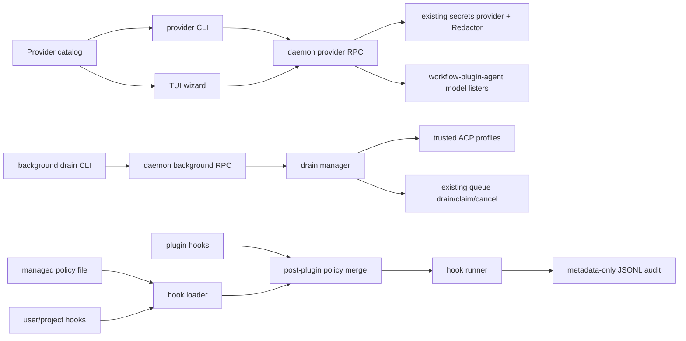

# Ratchet CLI Provider, Drain, and Managed Hook Design

## Goal

Deliver the next three ratchet-cli improvements as separate, releasable changes:

1. Make provider and model setup one domain shared by the CLI and TUI so new
   providers, auth methods, settings, and model discovery cannot drift.
2. Let the daemon supervise explicitly enabled background ACP queue drains for
   trusted agent launch profiles.
3. Add OS-managed hook policy with immutable precedence, managed-only mode, and
   metadata-only execution auditing.

The design preserves ratchet's local-first architecture. It does not add a
remote control plane, another provider SDK, another secret store, or detached
shell scheduling.

## Current State

The CLI provider path supports AWS Bedrock settings, compatible/custom
endpoints, settings-aware model discovery, manual model fallback, ChatGPT
device auth, and CLI-backed providers. The TUI onboarding wizard has a separate
five-provider table, drops provider-specific settings, and uses a different
model discovery call. Users therefore see different capabilities depending on
which entry point they choose.

ACP queue draining already has ownership, cancellation, and stale-recovery
semantics, but it only runs while a foreground command is attached. The daemon
already owns durable lifecycle work and is the correct supervisor for optional
unattended drains.

Hooks can come from user, project, and plugin sources. Trust is local and
project-oriented; there is no administrator-enforced policy, managed-only
mode, or durable execution audit.

The intermittent long-sequence TUI smoke-test shutdown assertion discovered
during baseline verification is handled by a prerequisite PR. Fresh-process
exit tests own shutdown behavior; the long all-surfaces test owns navigation
and rendering coverage.

## Global Design Guidance

Sources: repository README and `docs/policy-matrix.md`, plus
`GoCodeAlone/workspace` `docs/design-guidance.md`.

| guidance | design response |
|---|---|
| Keep Go as the primary implementation language. | All catalog, daemon, policy, CLI, and TUI work remains Go-native. |
| Reuse provider/plugin SDKs and existing secret infrastructure. | Model listing continues through `workflow-plugin-agent/provider`; provider credentials remain in the daemon's existing secrets provider and existing `secrets.Redactor`. |
| Never log secrets or sensitive prompt content. | Background state stores queue/profile metadata only; hook audit stores hashes and outcomes only. |
| Audit privileged or unattended behavior. | Background policy changes and managed hook execution produce redacted, local JSONL metadata records. |
| Prefer daemon-owned lifecycle and explicit policy. | The daemon owns workers; CLI commands only mutate/query policy through RPC. |
| Support Windows as a release target. | No Unix process groups, shell detachment, cron, or POSIX-only managed paths are assumed. Windows tests and release smoke remain required. |
| Merge only after local verification and green PR checks. | Each implementation PR has focused tests, full repository tests, runtime proof, CI monitoring, merge, and a release tag. |

## Architecture

### 1. Shared Provider Setup Catalog

Add a UI-agnostic catalog under `internal/provider`. A catalog entry owns:

- canonical provider type and accepted aliases;
- display name, category, and description;
- auth strategy and setup strategy;
- API-key environment name, when applicable;
- base-URL policy and default URL;
- typed provider-setting fields, including secret presentation metadata;
- model discovery strategy and manual-model fallback policy;
- setup-guide fields used by human and JSON CLI output.

The catalog covers every user-selectable runtime provider registered by
`workflow-plugin-agent`, excluding test-only `mock`. Duplicate runtime aliases,
such as `bedrock` and `anthropic_bedrock`, resolve to one canonical visible
entry while remaining accepted on input.

The current orchestrator registry keeps its factory map private, so a small
upstream prerequisite adds a sorted, defensive-copy `ProviderTypes()` query to
`workflow-plugin-agent/orchestrator.ProviderRegistry`. That package remains the
runtime source of truth. Ratchet's catalog coverage test compares against the
exported runtime set after excluding documented test-only types; it does not
duplicate an expected provider list in a test.

Provider-specific network calls and SDK behavior remain in
`workflow-plugin-agent/provider`. Ratchet supplies settings and renders
responses; it does not implement AWS, OpenAI, Anthropic, or model APIs.

The CLI adapter and Bubble Tea wizard both consume catalog entries. Neither may
define a second provider list. Contract tests compare catalog coverage to the
CLI setup surface and TUI navigation surface.

#### TUI Flow

The TUI wizard becomes a catalog-driven state machine:

1. Choose a categorized provider from a scrollable, filterable list.
2. Complete only the auth/setup path declared by the entry.
3. Enter declared settings and optional base URL.
4. Run settings-aware model discovery asynchronously.
5. Choose a discovered model or enter one manually when allowed.
6. Review non-secret values and submit once to the daemon.

Secrets remain transient in the TUI model and are sent only to the dedicated
daemon `CommitProviderSave` RPC. Legacy `AddProvider` delegates to the same
durable server path. The daemon stores credentials through its existing secrets
provider and adds them to its existing redactor. Secret settings are not
included in review text, errors, or snapshots.

CLI-backed providers use their catalog setup strategy and health checks rather
than API model discovery. ChatGPT subscription auth reuses the current device
flow. Cloud and compatible providers pass their catalog-declared settings to
the existing settings-aware model lister. Unsupported listing falls back to a
manual model field instead of trapping the user.

### 2. Daemon-Supervised Background ACP Drain

Add a daemon-owned background drain manager and gRPC operations for start,
stop, status, and list. The CLI surface is:

```text
ratchet acp client background start <session-id> --agent <profile> --acknowledge-unattended
ratchet acp client background status [<session-id>]
ratchet acp client background stop <session-id>
```

Start is rejected unless unattended execution is explicitly acknowledged.
Only built-in agents and trusted stored ACP launch profiles are eligible.
Arbitrary persisted argv, shell commands, and untrusted custom profiles are not
accepted.

Each persisted policy contains the ACP client session ID, profile name,
descriptor hash, acknowledgement timestamp and policy version, enabled state,
timestamps, and last terminal outcome. It contains no prompts, responses,
environment values, or credentials. State is written atomically with
owner-only permissions in the existing ratchet state tree.

At start and daemon restart, a stored profile is eligible only when `Trusted`
is true, its stored trust hash equals its current `DescriptorHash()` (including
command, args, environment-key names, and working directory), and that hash
matches the policy's pinned hash. Built-ins pin the current `AgentSpec`
fingerprint. Any mismatch moves the entry to `blocked` without launching an
agent. The registry's general trusted-profile loader is hardened to apply the
same hash-validity rule so background execution cannot become the only secure
consumer. A failed agent run moves the entry to `error` and stops automatic
retries; an operator must explicitly start it again. This prevents
cost-amplifying retry loops.

Stop first disables the persisted policy, then cancels the active drain through
the existing cancellation path. Queue claim ownership, cancellation, and stale
recovery continue to use existing ACP client logic. The manager does not
duplicate queue semantics.

The manager uses Go contexts and daemon lifecycle hooks on all platforms. It
does not use `nohup`, shell detachment, cron, launchd, systemd, or Windows Task
Scheduler.

Service construction receives the manager as an owned dependency. Test and TUI
smoke constructors inject a disabled/no-op manager so persisted host state can
never start unattended work during tests.

### 3. Managed Hook Policy and Audit

Add an optional administrator-owned YAML document at the platform path:

| platform | default path |
|---|---|
| Linux | `/etc/ratchet/managed-hooks.yaml` |
| macOS | `/Library/Application Support/ratchet/managed-hooks.yaml` |
| Windows | `%ProgramData%\\ratchet\\managed-hooks.yaml` |

Tests inject a path directly. Environment variables do not override the
production policy path because an unprivileged process environment is not an
administrative trust boundary.

The loader opens the final file without following symlinks, requires a regular
file, and validates administrative ownership before parsing. Unix files must
be owned by root and not group/other writable. Windows files must have a DACL
that grants modification only to Administrators and SYSTEM. If the platform
cannot establish that boundary, the present file is rejected rather than
treated as managed policy.

The policy mode is one of:

- `additive`: managed hooks run with eligible user, project, and plugin hooks;
- `managed-only`: user, project, and plugin hooks remain discoverable for
  diagnostics but are suppressed at execution time.

Managed hooks have immutable source provenance and are trusted by the
administrator-owned file boundary. Local trust and disable commands reject
attempts to alter them. Plugin hooks are filtered only after plugin merge so
managed-only cannot be bypassed by reload order.

Project hooks are loaded lazily from a session working directory at event time.
The engine therefore applies effective managed policy at the final
`EngineContext.RunHooks` composition point, after daemon user/plugin hooks and
the event's project hooks have merged. Reload-time annotation alone is not an
enforcement boundary.

A missing managed file means no managed policy. An existing malformed file is
a fail-closed error during daemon startup and hook reload. The runtime must not
silently continue with unmanaged hooks after an administrator attempted to
install policy.

Hook execution appends owner-readable JSONL records containing timestamp,
event, hook configuration hash, source kind, result class, and duration. A
`started` record is durably appended before a managed hook launches; if that
append fails, the hook does not run. A terminal record follows execution; its
append failure is surfaced and marks hook auditing degraded until a later
successful write. The record excludes command text, environment, input
payload, stdout, stderr, and error text. If future fields contain text, they
must pass through the existing `secrets.Redactor`; no second redaction
implementation is introduced.

`ratchet hooks list` exposes source and suppression status. `ratchet hooks
policy` reports effective mode and policy source. `ratchet hooks audit` reads
the local metadata stream in human or JSON form.

## Data Flow



## Error Handling

- Catalog validation fails tests on duplicate aliases, unknown strategies,
  missing required fields, or runtime-provider coverage gaps.
- Provider setup keeps user-entered non-secret state when discovery fails and
  offers manual entry only when the catalog allows it.
- Ambiguous provider-save responses poll operation state for at most 10 seconds
  with bounded backoff. Pending, applied, not-found, and temporary RPC failure
  remain unresolved until the deadline; committed returns the stored provider;
  failed returns a classified outcome. Unresolved exit requests stay in the UI.
- Every current CLI writer uses a signal-aware 30-second `CommitProviderSave`
  call and a separate 10-second reconciliation context. Old daemons return
  `Unimplemented` before mutation. First interrupt shows reconciliation status;
  second interrupt exits with the operation ID for explicit status lookup.
- Applied-operation finalization uses daemon-owned timeouts and is retried by
  operation queries and startup, independent of the canceled caller context.
- Nil provider/list/test/auth success responses and whitespace-only required
  credentials or endpoints are explicit recoverable errors.
- Daemon background start validates acknowledgement, trust, fingerprint, and
  session/profile existence before persistence and launch.
- Background worker panics and terminal agent errors are contained, recorded as
  outcome classes, and do not trigger automatic retry.
- Managed policy parse or validation errors identify the file and field without
  including hook commands or environment values.
- A managed hook does not launch unless its `started` audit record is durable.
  Terminal append failure is surfaced as degraded audit state. Unmanaged-hook
  audit behavior remains best effort unless a managed policy requires auditing.

## Security Review

- **Credential custody:** credentials remain in the daemon's existing secret
  provider; server-generated UUID versions use reserved `provider-v2-` keys.
  Client IDs are canonical UUIDs but never form secret keys. Operation rows and
  RPCs exclude credentials, request bodies, settings, base URLs, and raw errors.
  Server keys contain only a reserved prefix, server timestamp, and UUID. Existing
  `secrets.Redactor` protects runtime errors and may safely over-redact retired
  values until restart.
- **Mutation serialization:** daemon-owned per-alias workers cover provider
  save/remove through terminal state while unrelated aliases proceed. One ID is
  admitted: same-ID calls attach; another gets `AliasBusy` without retention.
  Pending rows reserve keys before `Set`; a two-worker deduplicated cleanup pool
  excludes provider references and pending/applied reservations.
- **Worker safety/order:** worker guards recover panics into classified durable
  failure and release ownership. A short provider-row mutex spans apply through
  terminal finalization and orders default/model/remove row mutations, but never
  wraps secret-provider calls. Cleanup retry persists `next_attempt_at`; one
  due-row dispatcher feeds two short workers so poison rows cannot starve later
  entries.
- **Unattended execution:** opt-in is explicit and profile identity is pinned.
  Profile trust/fingerprint drift blocks resume. Persisted arbitrary commands
  are prohibited.
- **Administrative policy:** production paths are fixed by OS convention and
  rely on administrator-managed file permissions. Managed-only applies after
  plugin loading and cannot be weakened by user state.
- **Audit minimization:** audit records carry hashes and outcome classes, not
  executable commands or content. Files use owner-only permissions and atomic
  append/open behavior where supported.
- **Denial/cost controls:** background errors stop instead of retrying forever;
  only one worker may own a queue policy; start is idempotent for an identical
  active policy.
- **Dependencies:** no TypeScript runtime, AWS reimplementation, new provider
  SDK, remote service, or secret/redaction subsystem is added.

## Infrastructure Impact

No cloud infrastructure, production deployment, or remote service is required.
PR 2 adds required local SQLite `provider_operations` and
`provider_secret_cleanup` tables; migration failure is fatal before RPC
acceptance. Terminal operations retain 24 hours. An OS-level exclusive lock is
held for daemon lifetime and acquired before PID/socket cleanup, migration, or
reconciliation (`flock` on Unix; `LockFileEx` on Windows). Startup then finalizes
applied rows after registry/redactor refresh, fails inherited pending rows, and
queues only unreferenced `provider-v2-` secrets plus durable cleanup. Secret
`List` is fail-stop before RPC acceptance because the provider may ignore
context; deduplicated `Delete` runs asynchronously through a two-worker pool
with bounded backoff after references are journaled.
Release artifacts remain the existing GoReleaser matrix, including Windows.

## Multi-Component Validation

| boundary | proof |
|---|---|
| Upstream registry to catalog | A real `workflow-plugin-agent` registry exposes sorted runtime types; ratchet's contract test excludes only documented test types and requires every remaining type to resolve through the catalog. |
| Catalog to CLI | Contract tests enumerate every visible catalog entry through setup list/guide commands and accepted aliases. |
| Catalog to TUI | State-machine tests traverse auth, settings, discovery, manual fallback, CLI-backed setup, and secret review suppression from catalog entries. |
| Provider save transaction | Real daemon + SQLite + stateful secret provider prove pending journal, idempotent replay/conflict, commit result, rollback preserving the active credential, cache invalidation, redactor registration, restart transition, cleanup retry, and exact operation polling. |
| TUI runtime | A persistent smoke daemon plus local OpenAI-compatible HTTPS fixture drives real PTY/ConPTY catalog navigation and one complete save through `CommitProviderSave`; tests inspect operation/provider/secret state, redaction, and sentinel-free output. Registry resolution consumes the rotated credential through a production-valid HTTPS endpoint rather than bypassing constructor security validation. |
| Daemon restart | Integration test persists an enabled policy, restarts the service, proves matching trusted profile resumes, then proves fingerprint drift blocks launch. |
| Queue lifecycle | Existing claim/cancel/stale paths are exercised through the daemon manager with fake agents and deterministic contexts. |
| Managed hooks | Loader/engine tests cover missing, malformed, insecure ownership/link, additive, managed-only, plugin reload, immutable trust/disable, pre-launch audit failure, and terminal audit failure behavior. |
| Windows | `GOOS=windows` build plus native `windows-2025` lock contention/release and ConPTY tests run before merge; CI Windows jobs remain required. |
| Release | Tag points to the merged commit; archives, checksums, Homebrew update path, and installed `ratchet --version` are verified. |

## Integration Matrix

| integration | status | proof or rationale |
|---|---|---|
| `workflow-plugin-agent/orchestrator.ProviderRegistry` types | runtime-integrated | Upstream API test plus ratchet catalog coverage test against a real registry instance. |
| `workflow-plugin-agent/provider` model listing | runtime-integrated | CLI/TUI tests pass real settings into its lister boundary; credentialed live provider calls remain deferred CI. |
| Existing daemon provider RPC, registry, and secrets provider/Redactor | runtime-integrated | A dedicated durable-save RPC makes old daemons fail pre-mutation; real daemon tests exercise legacy delegation, versioned secret pointer commit/rollback, operation query/replay/finalization, registry resolution, redactor ordering, serialized cleanup, and secret-free TUI/output. |
| Bubble Tea provider/model wizard | runtime-integrated | State tests plus real PTY navigation/render proof. |
| Daemon gRPC/client background API | runtime-integrated | Started daemon, real client, fake ACP process, persisted restart and stop proof. |
| ACP profile store and queue claim/cancel/recovery | runtime-integrated | Real stores and existing drain path; trust-hash drift has a negative launch proof. |
| User/project/plugin/managed hook sources | runtime-integrated | Engine reload plus event-time project load test merges all sources and executes only the final effective set. |
| OS managed-policy paths and ownership checks | runtime-integrated | Platform unit tests; Windows DACL and Unix ownership/link tests use platform-specific files. |
| External managed policy service/SDK | deferred | No remote control plane is required for local administrator policy. |
| Credentialed third-party provider discovery | deferred | Requires repository secrets and is not needed to prove catalog/wiring behavior. |
| VS Code-style harness optimization loop | deferred | Next design cluster after this scope, based on current primary sources and code. |

No plugin-contributed host UI is added. The TUI proof exercises ratchet's own
wizard rather than a contribution metadata route.

## PR and Release Boundaries

1. `workflow-plugin-agent`: exported provider-type introspection prerequisite.
2. `ratchet-cli`: provider catalog and unified CLI/TUI wizard, including the
   released plugin dependency bump.
3. `ratchet-cli`: daemon-supervised background ACP drains.
4. `ratchet-cli`: managed hook policy and audit.

Each PR is independently tested, reviewed, merged, and released. Later PRs
rebase onto the released predecessor. The prerequisite TUI smoke stabilization
PR is not part of this four-PR scope. Public policy/parity docs transition
background drain and managed hooks from deferred to supported only in the PR
that supplies their runtime proof.

## Assumptions

- `workflow-plugin-agent` remains the source of provider runtime and model
  listing behavior and can expose its registered type names without exposing
  factories or mutation.
- The daemon is the only ratchet process expected to supervise durable local
  jobs.
- A trusted ACP profile name plus descriptor fingerprint is sufficient stable
  launch identity for this local policy.
- Administrators protect managed policy files with OS permissions appropriate
  to their deployment.
- Missing administrator policy is normal; malformed present policy is an
  intentional configuration error.

## Out of Scope

- Remote fleet policy, centralized audit upload, or a management SDK.
- Arbitrary background shell commands, detached processes, or schedule syntax.
- New provider SDKs, model APIs, secret stores, or redaction types.
- Autonomous mutation of ratchet's own source or prompts.
- VS Code-style harness optimization experiments; this is the next planned
  cluster after the three PRs and will use current source/documentation rather
  than memory.

## Approaches Considered

### Provider Setup

1. **Chosen: shared UI-agnostic catalog.** One capability definition feeds both
   renderers while auth/network behavior stays in existing packages.
2. Daemon-rendered wizard RPC. Rejected because protobuf would own presentation
   policy and make local UI iteration a daemon contract change.
3. Separate CLI/TUI implementations with conformance tests. Rejected because
   tests would detect drift after duplication instead of removing its cause.

### Background Drain

1. **Chosen: daemon-owned workers and persisted policy.** Reuses lifecycle,
   claims, cancellation, and cross-platform contexts.
2. Detached foreground command or cron wrapper. Rejected because supervision,
   cancellation, restart semantics, and Windows behavior are unreliable.
3. Persist arbitrary launch argv. Rejected because it creates an unattended
   command-execution store with weak identity and audit semantics.

### Managed Hooks

1. **Chosen: fixed OS policy path, explicit precedence, post-plugin filtering.**
   This provides a real administrative boundary and observable enforcement.
2. Pre-seed the existing trust store. Rejected because users could still add or
   run hooks and plugin reload could bypass managed-only intent.
3. Remote policy service. Rejected as unnecessary infrastructure and an
   inappropriate expansion of this local-first slice.

## Self-Challenge

- The provider wizard refactor has the broadest visible UI blast radius. It
  must preserve navigation/back behavior, keep values on recoverable errors,
  and prove long lists do not hide controls or overflow terminals.
- The most dangerous background assumption is that restart equals permission
  to execute. The fingerprint/trust/acknowledgement gates are therefore
  negative integration tests, not documentation promises.
- The managed-hook failure boundary must distinguish absent policy from broken
  policy. Treating both as optional would silently defeat administration;
  treating both as fatal would make unmanaged installs unusable.
- Metadata-only audit is intentionally less convenient for debugging. Command
  output belongs in an explicitly redacted diagnostic path, not a durable
  privileged execution log.
- A provider catalog can become a new source of truth that lags the plugin.
  Registry coverage tests and alias validation make that drift fail CI.

## Rollback

Each PR can be reverted independently. PR 2's additive operation/cleanup tables
are ignored by older binaries; provider rows keep exact versioned secret names,
which existing registries resolve. The additive daemon lock file is ignored by
older binaries. Legacy clients without operation IDs remain
accepted; new writers call a dedicated RPC that old daemons reject before
mutation. Downgrade requires stopping the new daemon and observing lock release;
then process pending cleanup where possible. Old writers
may leave inactive `provider-v2-` versions, which a later upgraded startup
sweeps without touching referenced or legacy-prefix secrets. Before release,
background source changes may be reverted after stopping workers. After release,
stop or disable policies with the current binary and publish an upgrade-forward
patch that retains authority-aware state readers and writers; do not launch an
older binary against released background state. Managed-hook rollback must be
coordinated with administrators because removing enforcement weakens policy;
preserve audit records.

### Backport 2026-07-10: CLI setup semantics and failed-test cleanup

Cause: Catalog consumers treated setup alias, provider alias, executable, and
working directory as interchangeable; failed provider cleanup was fire-and-forget.
Change: Name all four CLI values in the catalog contract, share health-check
arguments, execute TUI health checks, persist the working directory, and await
provider removal before review/re-add.
Scope: no manifest change; corrections satisfy Tasks 2-4.
Evidence: `go test ./internal/provider ./cmd/ratchet ./internal/tui/pages -count=1`
must pass before PR 2.

### Backport 2026-07-10: Provider upsert commit boundary

Cause: daemon `AddProvider` is an alias-keyed upsert, so wizard compensation by
alias could delete a pre-existing provider and could not restore its prior
secret. Change: Review confirmation is the commit boundary; navigation never
deletes a saved provider, save/test RPCs are bounded, cancellation reports any
committed provider to the app, and explicit provider removal remains a separate
user command. Scope: no manifest change; this corrects Task 4 lifecycle
semantics. Evidence: focused lifecycle tests cover save/cancel races, failed
test navigation, nil RPC results, process reaping, and app cache reconciliation.

### Backport 2026-07-10: Durable provider-save operations

Cause: round-five review proved alias-stable secret mutation and one-shot list
reconciliation cannot make an upsert atomic or authoritative. Change: use
two-phase pending/applied/terminal operations, server-derived versioned keys,
idempotent replay, durable old-secret cleanup, and a metadata-only operation RPC.
All current CLI/TUI writers use a dedicated durable RPC, canonical UUIDs,
bounded signal-aware saves, and detached reconciliation; legacy `AddProvider`
delegates durably on new daemons. Pending secret reservations exclude runtime
cleanup/save races. Daemon-owned per-alias workers
admit one ID, attach replay, reject other IDs as busy, and let non-cancellable
secret calls continue without blocking unrelated aliases. A deduplicated
two-worker cleanup pool rechecks references. The lifetime lock excludes
concurrent startup; startup resolves pending/applied rows and orphans before RPC
acceptance; migration failure is fatal. SQL records `applied`; a
daemon-context/query-assisted finalizer performs cache/redactor work before
externally visible `committed`. See
`decisions/0006-make-provider-saves-durable.md`.
Scope: no manifest change; Task 4 gains daemon/proto/client correction work and
Task 5 gains restart/cleanup/runtime proof. Evidence required: hostile IDs,
duplicate/replay conflict, secret rollback, registry resolution, restart states,
cleanup retry/sweep, delayed operation polling, nil list, Ctrl+C wait, CLI/TUI
coverage, and Windows build tests.

### Backport 2026-07-10: Contract test staging

Cause: Checkpoint 4A names `TestProviderOperationRPCContract` in the daemon
package but its staging command omitted the modified daemon test file.
Change: stage `internal/daemon/integration_test.go` with the generated contract
and client compile-contract test.
Scope: no manifest change; Task 4 and PR 2 are unchanged.
Evidence: removing the generated contract makes both named tests fail on the
missing RPC/types; restoring it makes the focused command pass.

### Backport 2026-07-10: Tagged TUI smoke lifecycle

Cause: the tagged TUI smoke service constructed an engine without starting the
durable provider-operation manager, so its legacy `AddProvider` fixture failed
before the TUI launched. Change: start and stop the real operation manager with
the smoke service. Scope: no manifest or PR change; this moves an existing Task
5 service-lifecycle prerequisite forward so Task 4's locked TUI verification can
run. Evidence: `TestTUIBinarySmokeSlashExit` fails with `FailedPrecondition`
before the fix and passes after it.

### Backport 2026-07-10: Durable timestamp and harness invariants

Cause: binding `time.Time` directly produced SQLite text that `unixepoch()`
read as `NULL`; the existing E2E harness and redactor test also assumed legacy
alias-stable secret labels.
Change: persist operation/retry deadlines as RFC3339, compare them through
SQLite `unixepoch()` rather than mixed-format text ordering, assert non-null
operation timestamps through the RPC, initialize the real operation manager in
the shared harness, and derive redactor labels from the committed provider pointer.
Scope: no manifest change; Task 4B files/staging now name both shared tests.
Evidence: the focused 4B suite and `go test ./internal/daemon -count=1` pass;
removing the durable manager makes the named tests fail at compile time.

### Backport 2026-07-10: Native daemon lock dependency

Cause: Windows `LockFileEx` requires `golang.org/x/sys/windows`; the module was
already pinned transitively but 4C's staging list did not name `go.mod`.
Change: promote the existing `x/sys` version to a direct dependency and use its
platform-native `windows.Overlapped` type; Unix uses the sibling `unix.Flock`.
Scope: no manifest change; Task 4 and PR 2 are unchanged.
Evidence: Unix lock tests pass and the Windows daemon test binary cross-compiles.

### Backport 2026-07-11: Native OpenAI token-limit config

Cause: the fresh-process Custom provider smoke reached Genkit with Ratchet's
nonzero token default, but `workflow-plugin-agent` passed
`*ai.GenerationCommonConfig` to an adapter requiring
`*openai.ChatCompletionNewParams`.
Change: consume `workflow-plugin-agent` v0.12.8; direct OpenAI/Azure use
`max_completion_tokens`, generic compatible endpoints retain `max_tokens`.
Scope: no manifest change; dependency correction is required by Task 5's real
save/test proof.
Evidence: upstream PR #41 regression tests cross constructor, Genkit, and local
HTTP boundaries; Ratchet `TestTUIBinarySmokeProviderSave` must reach a
successful connection before persistence assertions.

### Backport 2026-07-11: SQLite smoke connection pragmas

Cause: modernc SQLite ignores `_journal_mode` and `_busy_timeout`; the restart
proof exposed immediate `SQLITE_BUSY` despite the intended timeout.
Change: configure smoke WAL and busy timeout through supported repeated
`_pragma` parameters on service and inspection handles.
Scope: no manifest change; this corrects Task 5's persistent restart fixture.
Evidence: durable upsert/retry injection fails `database is locked` with the
old DSN and converges with `_pragma=busy_timeout(5000)`.

### Backport 2026-07-11: Mixed-version fixture dependency and journal proof

Cause: the pre-RPC compatibility revision pins the pre-fix provider adapter, so
its real Custom provider test cannot reach the mixed-version fixture; terminal
cleanup state alone also cannot prove durable journaling.
Change: preserve the historical source/proto boundary while pinning its detached
build to released `workflow-plugin-agent` v0.12.8. The downgrade harness proves
the current daemon lock is held before release, uses a deterministic database
trigger to hold the production-created cleanup row, then releases the gate and
requires exact file-provider secret/journal convergence. Git/build diagnostics
are redacted and worktree cleanup is registered before creation.
Scope: no manifest change; this hardens Task 5's existing downgrade proof.

### Backport 2026-07-11: Legacy provider failure status

Cause: legacy synchronous `AddProvider` delegated to durable saves but flattened
all terminal operation failures into gRPC `Internal`, hiding actionable busy,
conflict, invalid-request, and unavailable-secret-store outcomes.
Change: map durable failure enums to stable gRPC status codes and retain the
non-secret provider-settings parse reason under a bounded validation prefix.
Scope: no manifest change; this preserves Task 4's legacy compatibility while
making Task 5 failure evidence actionable.
Evidence: a blocked alias crosses the real `AddProvider` boundary as `Aborted`;
table coverage fixes all failure mappings, and malformed settings retain the
JSON parser reason without echoing the settings body.

### Backport 2026-07-11: Background drain durability boundaries

Cause: primary policy and co-located side-journal writes can fail together;
shutdown can race admitted persistence; Windows child creation can precede
privacy enforcement and replacement durability. Change: treat the independently
fsynced terminal audit as an authoritative recovery WAL, close lifecycle
admission and await admitted persistence before shutdown returns, protect the
Windows directory before child creation, and replace with
`MOVEFILE_REPLACE_EXISTING|MOVEFILE_WRITE_THROUGH`. Scope: manifest unchanged;
this corrects Task 6. Evidence: co-failure restart, stop ownership, joined-error,
blocked-persistence shutdown, native Windows DACL/replacement, and releaseguard
tests.

### Backport 2026-07-13: Authoritative background audit order

Cause: wall-clock comparison, non-inheriting Windows ACEs, and file-only WAL
sync weakened the recovery boundary. Change: JSONL append position is the sole
recovery order; policy JSON is a projection and the transition journal remains
supplemental partial-write recovery. Parent completion maps to lifecycle
shutdown. New WAL creation requires file close plus supported parent-directory
sync before success, and protected Windows directory ACEs inherit to raw child
objects before creation. Scope: manifest unchanged; this hardens Task 6.

### Backport 2026-07-13: Transactional ACP session projection

Cause: atomic rename protected `sessions.json` parsing but did not serialize
cross-handle or cross-process load/mutate/save transactions, so drain writeback
could overwrite a concurrent enqueue. Change: guard every complete session-file
transaction with an owner-only OS lock (`flock` or `LockFileEx`) and use private,
crash-safe replacement on Windows; audit parent sync runs after every append,
including retries; explicit start/resume durably removes any stale terminal
transition before launch state/audit commit. Scope: manifest unchanged; this
corrects Task 6.

### Backport 2026-07-13: Transactional ACP session adjuncts

Cause: caller-side session read/replace, owner JSON existence, and unlocked
event-log sequencing remained stale cross-process snapshots. Change: lifecycle
record updates and archive insert-if-absent checks transact under the complete
sessions lock; a drain/direct run holds a per-session OS owner lease and treats
JSON as metadata only; every event-log read/append/replace/metadata/copy uses a
per-log OS transaction lock. Unsupported platforms return
`ErrStoreProcessLockUnsupported`; no in-process fallback claims cross-process
safety. Scope: manifest unchanged; this completes Task 6's transactional state
boundary.

### Backport 2026-07-13: Cross-process supervision and archive snapshots

Cause: policy/transition/audit mutexes stopped at the process boundary,
watchers released ownership between drain cycles, archive import committed its
record before raw history, export checked ownership before taking its snapshot,
and unsupported Unix targets had no lock implementation or explicit fallback.
Change: use owner-only OS side locks for complete background file operations;
hold one owner lease for a watch lifetime; commit imported session/history under
the sessions and event-log transaction locks with retryable failure semantics;
hold an export lease through snapshot creation; and make the unsupported build
tag the exact complement of implemented OS locks. Scope: manifest unchanged;
this closes Task 6's adversarial concurrency review.

### Backport 2026-07-13: Completion and lease failure ownership

Cause: projection cleanup could strand an OS lease, runner close errors were
discarded, session/queue completion preceded event-history persistence, and an
export snapshot looked like cancelable execution. Change: release always
attempts projection cleanup and unlock; drain close failures terminate the
watch; completion plus event append commits under the sessions-to-event lock
order with rollback on session-save failure; and owner metadata distinguishes
backward-compatible execution from non-cancelable snapshots. Scope: manifest
unchanged; this closes Task 6's second adversarial review cycle.

### Backport 2026-07-13: Cross-process lifecycle and commit-stage ownership

Cause: paired session/event writes could mistake a post-replacement durability
or ACL error for a pre-commit failure and remove the matching projection;
background transition ownership ended at a manager process; and cancel checked
owner kind before, rather than during, durable request creation. Change: mark
post-commit filesystem errors and preserve logically committed session/event
pairs; hold a per-session OS background lease from transition persistence
through worker termination; and validate a live execution owner while holding
its claim lock through cancellation commit. Scope: manifest unchanged; these
are Task 6 durability and cross-process invariants from review cycle three.

### Backport 2026-07-13: Ownership handoff and private lock namespace

Cause: worker exit could reopen a transition without an OS lease, startup audit
reconciliation could overwrite another process's owned start, cancel sidecars
did not share commit classification with the session projection, lock setup
rewrote caller-owned parent permissions, and release errors could trigger a
write after ownership transferred. Change: every transition and terminal-audit
reconciliation owns the per-session process lease; cancel/session updates form
one private, rollback-aware transaction; physical locks live in a dedicated
owner-only namespace without changing caller parents; and a process never
persists state after releasing its lease. Scope: manifest unchanged; these are
Task 6 lifecycle and filesystem invariants from review cycle four.
An active worker is idempotent only when no local stop or transition is already
reserved for that session.

### Backport 2026-07-13: Authority-first side-state rewrite

Cause: final review proved that normalized trust hashes, pre-lease transition
snapshots, best-effort cancel rollback, torn JSONL tails, and link-following
append opens left five Important correctness/security gaps. Change: hash exact
persisted launch values; treat transition listings as hints and reload current
state after the session lease; make session status cancellation authority and
write the sidecar only as a compatibility projection; repair only an incomplete
final JSONL record under lock; and reject final symlink/reparse append targets.
See `decisions/0009-pin-acp-event-authority.md`. Scope: manifest
unchanged; this is the required review-cycle-five rewrite of Task 6.

### Backport 2026-07-13: Executable event and launch authority

Cause: review cycle twelve found that metadata-derived audit IDs could collide,
execution cancellation could self-cancel the ACP cancel send, copied profiles
could not retain trust through child start, and the plan omitted native/process
proof surfaces. Change: persist random transition event IDs; separate bounded
cancel-send and execution contexts; add a profile-lock-owning launch callback;
name all store/archive/client/platform files and Windows/process gates in Task 6;
and record released downgrade as an explicit unsupported operator risk. Scope:
manifest unchanged; Task 6 implementation details only.

### Backport 2026-07-13: Release-shaped authority proofs

Cause: review cycle thirteen found that standalone profile-lock and same-process
audit tests could pass while the production manager launch path or cross-daemon
retry remained unsafe. Change: carry a lease-owned launch closure from the
profile store through `BackgroundManager` and `WatchQueue`, prove the closure
holds through real `exec.Cmd.Start` with a second mutator process, prove audit
retry/interleaving with cooperating subprocesses, and releaseguard all four
native Windows attack tests. Scope: manifest unchanged; Task 6 proof wiring.

### Backport 2026-07-13: Fresh-process audit replay

Cause: live subprocess coordination could retain cached audit state and did not
prove restart recovery after an unconfirmed commit. Change: require an A/B/A2
process sequence driven by durable transition/audit files, explicit audit-lock
blocking, and exactly one committed record per ID. Scope: manifest unchanged;
Task 6 verification detail.

### Backport 2026-07-13: Cross-platform Windows releaseguard

Cause: Go excludes files ending `_windows_test.go` on non-Windows hosts, so the
planned host releaseguard command reported no tests. Change: keep native attacks
in ACP's Windows test file, but place declaration/skip/CI-selector checks in
cross-platform `internal/releaseguard/acp_background_guard_test.go`. Scope:
manifest unchanged; Task 6 verification filename only. Evidence:
`go test ./internal/releaseguard -run BackgroundWindows -count=1` executes and
passes on the host.

Rewrite contract:

- `CheckCancellation(id) (bool, error)` is authoritative and cancellation is
  monotonic. One guarded store transition handles every session mutation:
  `Store.Upsert`, lifecycle start/writeback, enqueue, stale recovery, claim,
  completion/failure, cancellation, and event-backed variants. `Upsert`
  preserves a latched cancellation. `InsertSession`, archive import insertion,
  and any future whole-record creator are create-only and reject collisions.
  A mechanical writer-inventory test fails when a session writer bypasses the
  guard or the explicit create-only allowlist.
  Post-latch enqueue/start/claim reject; recovery cancels; writeback preserves
  the latch; terminalization is `cancel_requested -> canceled`. No independent
  status assignment or check-then-claim path remains.
- `RunOptions.CancelRequested` becomes error-bearing. `(true, nil)` records
  `ErrCancelRequested` as the first cause; `(false, err)` records that authority
  failure and fails closed without reporting a user cancellation. A true request
  sends ACP cancel once on a separate bounded context derived with
  `context.WithoutCancel`, while prompt and child-process contexts are canceled
  independently. Send failure or deadline expiry cannot replace the first cause;
  either forces kill/reap. Authority failure skips ACP cancel and kills/reaps.
  All authority, ACP-send, and process watcher goroutines join before return,
  and the captured cause deterministically wins over a racing prompt result.
- Cancel commit order is sessions first, compatibility sidecar second. A
  sidecar failure returns degraded/unconfirmed state without undoing the primary
  commit. Reconciliation is one `sessions lock -> current reload -> sidecar
  mutation` transaction. Mixed-version notification remains explicitly
  best-effort. Released backward binary downgrade is unsupported; operators use
  the current binary to stop/disable policies and publish an upgrade-forward
  patch that retains authority-aware readers/writers. Pre-release branch
  reversion remains supported. This is an explicit, unenforced operator-risk
  boundary: accidental old-binary access may ignore authority state and is not a
  supported or recoverable downgrade path. No compatibility barrier or migration
  is introduced.
- Transition recovery is `list IDs -> session lease -> lock-held reload`.
  Missing means no-op; only the reloaded value may replay; no write follows
  lease release.
- Audit newline is the sole commit marker. Audit data and locks occupy a
  dedicated owner-only directory. Both `Read` and `Append` use one pinned-parent,
  handle-relative transaction, discard
  a non-newline suffix, and sync repair before use. Newline-terminated malformed
  records fail. `recordId`, `at`, `action`, `sessionId`, `profile`,
  `descriptorHash`, and `outcome` are required. Allowed pairs are start:started;
  resume:resumed;
  block:profile_untrusted/profile_drift/profile_missing/session_missing/policy_invalid;
  error:worker_error/worker_panic/state_write_failed/audit_append_failed; and
  stop:stopped/completed. Unknown JSON fields are ignored; new actions/outcomes
  require a format-version design. Raw event-log framing is unchanged and
  shares only the secure final-target open primitive.
- Secure audit mutation derives lock and data operations from one held parent
  identity. Final links/reparse points, non-regular files, wrong owners/DACLs,
  and multiple links are rechecked before mutation. The parent is owner-only, so
  same-owner relinking is outside the adversarial boundary. Unix uses `openat`
  from the held directory descriptor. Windows opens and holds the parent without
  `FILE_SHARE_DELETE`, records its identity with
  `GetFileInformationByHandleEx(FileIdInfo)`, acquires the path lock, revalidates
  that identity, opens the final object with `FILE_FLAG_OPEN_REPARSE_POINT`, then
  checks attributes, link count, owner SID, and protected DACL on the opened
  handle.
- Before first append, every audit-requiring transition persists a
  cryptographically random `eventId`; the immutable audit record uses
  `recordId = eventId`, and all retries/recovery reuse it. Distinct logical
  events receive distinct IDs even when their timestamps and visible metadata
  match. Append repairs then scans all committed record IDs under lock; a match
  is a no-op even when another session appended later. Errors after writing the
  complete newline are
  `ErrStoreCommitUnconfirmed`; retry reconciles before append. Tests inject
  write, sync, close, parent-sync, and repair failures.
- Descriptor hash payload keeps the existing field order and nil/empty encoding,
  preserves args order, sorts env keys, and hashes command/cwd exactly. Legacy
  normalized mismatches fail closed and require explicit retrust. Profile
  add/trust/remove/list are process-locked. `ProfileStore.WithTrustedProfile`
  owns the process lease, revalidates name/trust/pinned hash, and invokes its
  callback while locked. Initial manager resolution uses that callback through
  durable start/audit commit. For execution, `BackgroundManager` carries a
  lease-owning start closure through `WatchQueue`'s production `StartRunner`;
  copied profile data cannot escape and launch outside that closure. The closure
  builds the command, calls the real `exec.Cmd.Start` synchronously, and releases
  only after child-start success/failure acknowledgement.
- Tests cover every cancel commit stage and latch interleaving, an agent ignoring
  cancel, SIGKILL-created audit tails read before append, a two-process transition
  replacement race, Unix pre/post-validation link attacks, native Windows repair
  reparse/hard-link/DACL attacks, executable legacy-reader projection behavior,
  separate-process cancel-versus-claim/writeback; an audit restart harness where
  process A receives `ErrStoreCommitUnconfirmed` and exits, process B acquires
  the audit lock and appends another record, and fresh process A2 reloads the
  durable transition and retries with exactly one record per `recordId`; and a
  release-shaped `BackgroundManager -> WatchQueue -> StartRunner` test where a
  second mutator process blocks across a fixture child's real `exec.Cmd.Start`
  acknowledgement. A releaseguard asserts all named Windows attack tests remain
  under the CI selector. A host-injected unsupported-lock no-write
  proof covers AIX behavior; AIX remains cross-build-only and returns
  `ErrStoreProcessLockUnsupported` before mutation.

### Backport 2026-07-14: Cancellation launch admission

Cause: cancellation could commit after a queue item became `running` but before
`StartRunner`, and direct drain/watch callers did not repair the authoritative
session-to-sidecar projection. Change: serialize cancellation commit and the
authoritative pre-launch recheck plus synchronous runner start through a
per-session process lock; reconcile cancellation projections before direct
drain/watch ownership. Scope: no manifest change; this closes Task 6 review
findings. Evidence: deterministic cancel-first/start-first tests pass under
`-race` and 20 repetitions; projection repair/failure tests launch no worker or
owner before reconciliation succeeds.

### Backport 2026-07-14: Terminal test observation

Cause: terminal policy state becomes visible before the terminal audit append
and in-memory completion guard, but sibling tests treated that earlier state as
completion. Change: terminal-record assertions wait for the manager's terminal
guard; production persistence ordering is unchanged. Scope: no manifest change;
Task 6 verification only. Evidence: the four worker terminal paths pass under
`go test -race ... -count=20`.

### Backport 2026-07-14: Final cancellation linearization

Cause: a successful prompt could outrun the watcher's last authority poll;
idle watches and persisted manager starts lacked a final cancellation check;
session cancellation was recorded as `worker_error`; failed session setup
dropped cleanup errors. Change: serialize and repeat authority checking at
watcher shutdown; check every watch cycle; admit persisted start/resume through
the per-session launch lock; persist cancellation-only worker exit as
`stopped`; join startup cleanup failure. Joined independent failures remain
errors. Scope: no manifest change; this closes Task 6 review cycle 3. Evidence:
the four deterministic regressions pass 20 repetitions and under `-race`.

### Backport 2026-07-14: Terminal cancellation authority

Cause: final idle/maximum-cycle return and background completion persistence
could outrun a committed session cancellation; manager shutdown could mask that
session latch; initial cancellation still entered the prompt RPC; direct CLI
execution discarded close errors. Change: recheck WatchQueue and worker terminal
authority under per-session launch admission, persist cancellation-only or nil
worker exit as `stopped` when the latch is authoritative, abort before prompt on
initial authority failure, and join direct-client cleanup errors. Independent
joined worker failures remain errors. Scope: no manifest change; this closes
Task 6 review cycle 4. Evidence: four deterministic regressions fail without
the correction and pass with it under focused tests.

### Backport 2026-07-14: Terminal observability cleanup

Cause: an admission-lock release error replaced an already durable terminal
outcome in memory, and a prompt cancellation child context had no production
observer. Change: preserve the recorded state/outcome while marking it degraded
and joining the release error; remove the unused cause context. Watch cycle
callbacks remain non-terminal observations and precede final authority so a
callback-triggered cancellation is caught. Scope: no manifest change; Task 6
review cycle 5 minors. Evidence: focused release/error/cancellation tests pass.

### Backport 2026-07-14: Background RPC admission and integration

Cause: initial handlers ignored already-canceled RPC contexts; split fake
boundaries did not prove `internal/client.Client -> gRPC -> daemon.Service`;
timestamp and nil-shutdown edges were unchecked. Change: reject cancellation
before manager admission, then keep admitted work daemon-owned and idempotently
queryable; expose narrow service injection; exercise the combined real boundary
plus concrete missing/profile-drift paths; validate protobuf timestamps and nil
shutdown. Scope: no manifest change; Task 7 review cycle 1. Evidence: focused
daemon/client regressions fail before and pass after the correction.

### Backport 2026-07-14: Admitted shutdown preservation

Cause: shutdown racing an admitted start or resume could persist the enabled
policy, reject worker launch, then rewrite that durable request as
`disabled/stopped`. Change: manager closure after durable admission releases the
transition and returns `ErrBackgroundManagerClosed` without disabling the
policy; only explicit stop or authoritative session cancellation may do so.
Constructor failure now closes injected managers, and typed-nil injection
selects the disabled manager. Scope: no manifest change; Task 7 review cycle 2.
Evidence: deterministic start/resume race and lifecycle regressions fail with
the fixes reverted and pass with them restored.

### Backport 2026-07-14: Daemon lifetime ownership

Cause: signal/reload shutdown could close the engine before canceling the
daemon lifetime, while cron scheduler loops and detached tick children were not
joined. Change: daemon exit cancels one lifetime before service close;
`Service` owns a child context and an admission-gated wait group; cron shutdown
cancels and joins scheduler loops while preserving durable active jobs; admitted
tick children retain asynchronous cadence but are canceled and joined before
the engine closes. Scope: no manifest change; Task 7 review cycle 3. Evidence:
active-callback, lifecycle-cancellation, and detached-work regressions fail with
their ownership fixes reverted and pass restored, including `-race`.
